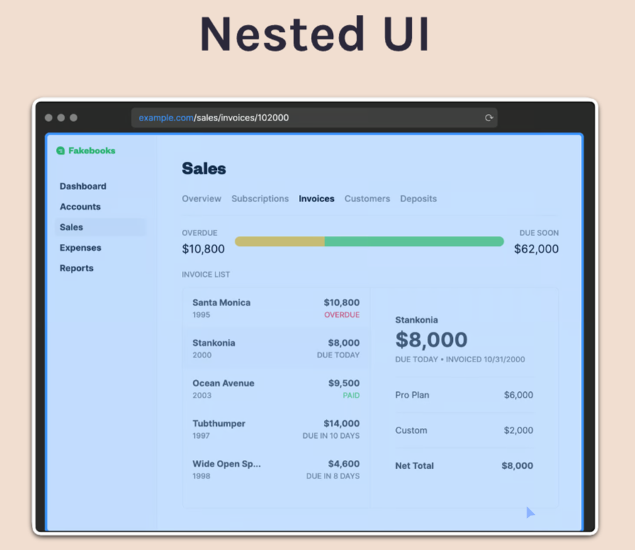

**React Routers Start**

Outline:-

What are SPAs?

Basic router setup

Route

Link

Route parameters

Nested routes and Outlet

Layout and Index routes

Relative paths

NavLink

Outlet context

Search parameters

Link state

404 page / Splat routes

Loaders

Actions

Form & form data

defer()

Await

Suspense

Error handling & errorElement

useRouteError

useNavigate

useNavigation

useLocation

useLoaderData

useActionData

Protected Routes

----------------------------------------
React routers enables us to do client-site routing.

MPA= Multi page applications
SPA= Single page applications 

<Link> it directs us to the page without loading the page, however it is not the best practice. We will see it later

There are two ways for routing
1. Route Params
2. Nested Routes

In this project I have used useParams() for nested routing purpose. The nested routing will be used in next project.

1. In route parms we can have useParams() to open a specific page of a speciic component /vans/:id
2. Now coming to the nested routing there are often situations where we want to keep the UI and just on the clicks we want to change some part of the UI. Just like the Image Below.

Example:-

Reason For Using Nesting instead of Route Params

