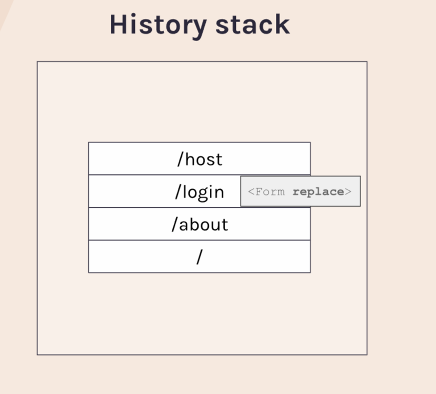

**Protected Routes**

IN THIS PROJECT THE AUTHENTICATION IS NOT THE REAL WORLD WAY OF DOING HOWEVER IT WAS NOT OUR CONCERN THAT'S WHY WE ARE GOIND IT WITH THE BAD WAY.

In this project we will use protected routes for the pages that we have created. This means that we will be using the various hooks and props from react-router. When the user tries to acces any protected route, the page will be redirected to the signin/signup page.

Request Waterfall= This is a demo showed by the remix that when a content of the page is being laoded, how the files within that page are being rendered.

Parallel Loaders= This happens when the page is being loaded and the components are bein g loaded asynchronously.

redirect = it is a utility that can be used to redirect to a new page. Lets say we want to acces /vans page but not logged in. So, when a user will press the vans button this action will be redirected to the sign in page.

useNavigate Hook / navigate:- It's usually better to use redirect in loaders and actions than this hook. The difference b/w <redirect/> and useNavigate() Hook or <Navigate/> is that the redirect can be used within the function whereas, the navigate can be used in the component.

loaders = It is a function that can be define in a <Route/>. This function is being runned when the Route is about to directed to the page. In the <Route/> when we be use loader the function runs at first then the route is being runned.

Params in loaders = In Previous project we have use useParams Hook. This hook gets the data after the "":"" in the url. for example /vans/:id. in this example this hook will get the data from the url of :id. The problem of using this hook that we can only use it in a component. Not in a function!! So, if we want to use it in the laoder then we will have to use this type of syntax without importing the useParams Hook. Syntax goes like this: function loader({params}){...}

Request in loaders= syntax like the params in loaders, check the docs for more info

From = The react-router forms are extermely easy to use regardless of the traditional react form. In react router forms we can don't need an event onChange to get the values and also we don't need the value attibute in the input tag to update the values on the screen. We also don't need the submit custom button to submit the form. And when we are handing the input in the useState, we also don't need the useState for this purpose. instead we will use actions for these purposes.

Actions in <Route/> form = While using the form from the react-router, we don't need the submit button for this purpose. The route that we are using to go to the login page in that router we will have to use a prop named action. like <Route to='/login' action={loginAction}/> the action takes up a function like a loader. From the login page we will export a action function and will use it in the action prop. We will chnage the From element property method to post, <Form method="post"> because by default the form gets the request. thats why you might have observed that on submitting the form the the inpuet fields are being attached into the URL, this is because the by default the From work as a get request.
The action function can take 2 parameters same as the loader function {params} && {request}. To grab the data from the forms we can use request parameter in the action function to get the data. There is a native formData request from MDN that can give us the values https://developer.mozilla.org/en-US/docs/Web/API/FormData

History Stack && Replace prop in navigate or Form= While navigating to the web browser you ofthen have notice that the page can get back to the another page. This is because of the history stack maintained by the browser. So, when we login and go back again it redirects to the login page again. To void this we can use <navigate replace={true}/> in this way by navigating to the back page the login page will not appear but the page before login page was visited will appear. See in the image below.

useActionData Hook= this is same as the useloaderData Hook. The props action needs to be passed in the <Route action={}/>. The action prop will take the function. While dealing with the action button the parameter can be either {params} or {request} just like the loader function. This is because the params  hook canot be accessed within the function it can only be accessed in the component. 
From the request parameter wwe can use formData like:- request.formData.get('email') check the mdn docs.

useNavigation Hook= This hook in the form page will return the states that can be useful in playing around. Like the state=idle and while we click on the submit button the idle statte changes to submitting.

URL api= URL is a web api can be checked on the mdn docs. This API serves as a searchParams and getting the parameters from the query parameters as well as it gets the path of it. I have used in the managing the redirection of the page. If a user clicks one of the protected route /vans it will be directed to the /login page then after logging in it will be redirected to the /vans page. Means the page from where the user will be directed to the /login page, afetr logging in the user will be redirected to the same page with authorization.  

