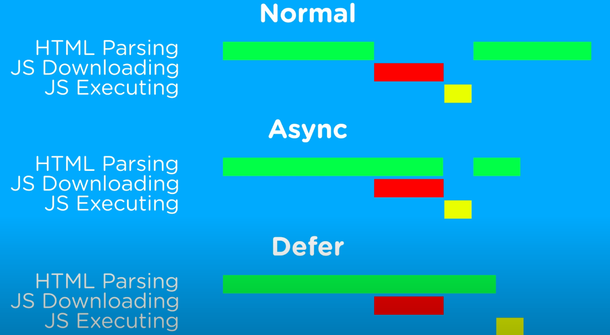

**Defer && Await && Suspense**

This is indeed the most difficult part of this project. Lets take a look at the image below

This concept is a bit related to the efficiency of the page laoding.
The Image above shows the traditional websites using the raw HTML, CSS and Vanilla JS for the website development. We=hat happens usually when the page is loaded the HTML file is being readed. The file contains the JS scripts tags in which different functionalities are being used. So, when we use synchrounous function the waterfall model of the website looks like the first one in the image.

1st Image:- The html elements are loaded then the JS files are downloaded after having them, JS files executes. Remaining lines are being read after it which may consist of html or maybe js css files. the index.html run from top to bottom synchrously.

2nd Image:- When we use Asynchronous function the downloading and loading of the html tags are async in nature but the execution takes time, during which the other operation are stopped from happening.

3rd Image:- This is where Defer comes in. The most efficient way for laoding the content. As it can be understood from the image, so I am going to explain the concept here.

But I would be discussing the working of defer, await in react-routers. 
There are few scenarios as far as I know to naviagte to another page and after navigation how does the Content load.

1. When we redirect, navigate, link, NavLink to the another page the Page layout is laoding but the content that is fetch through the API get loaded after few seconds. Depends on the API speed. For a better UX what we do usually that we create a Loading state meanwhile the data is being loaded. 

2. Now, to avoid this we use loader in the <Route />. What it actually does that before navigating to the other page the content of the page is preloaded then the other page is displayed. In a meanwhile the user can only see the current page through which he/she have click the navigation page. In this way there is no need of laoded however in some scenarios the APi is slow that can lead to the bad UX because when a user will click a route, the other page content will be loading and user will have to wait long and the only page user will see will be the current one. Often users will think that the page is not redirected or it got hang.

3. This is the Defer solution. We will be using <defer> to make efficient the point number 2. In this case we will use defer to Fetch APi in the loaders and will use <await> to fecth the data. In this way the in loaders we can use the defer and when a user will click to navigate to the page the next page will be loaded despite the content on that will still getting processed. But here we can use <Suspense> to create a loading page. You might think that why we are moving round and round. If we want to use the loading page then why not use the point 1 option simple. But the differnce is that we are usign defer that will fast up the process. BEcause the defer doesn't need to await. It saves the promise from the async function. And display on needed.

The <defer> and <await> is applied to these two files mentioned below.
vans.jsx
vansDetails.jsx
