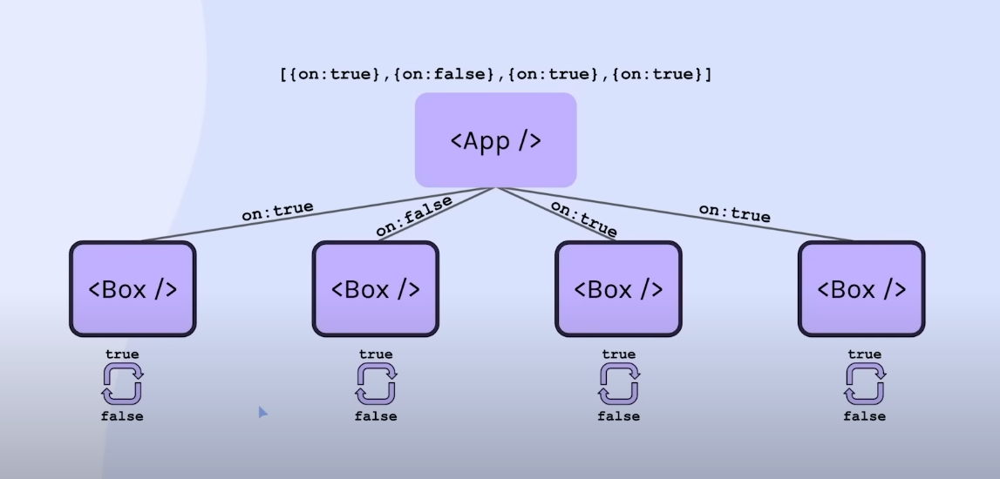
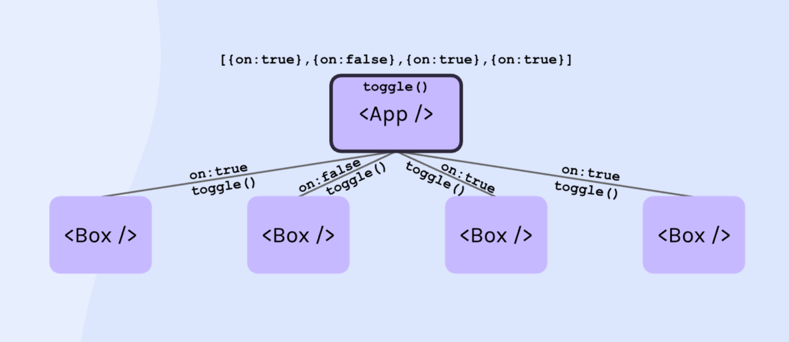
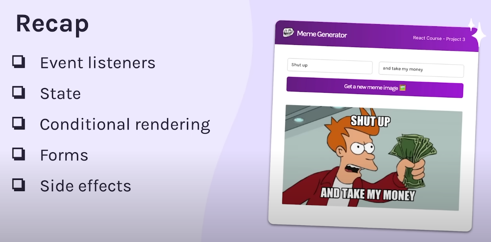

Props should be immutable atleast immutable within the function when passed. To change the values of the props Hooks(useState) can be used.

for example:-

function hello(props){
    props.items.url = 'imge/l/mkka'
}
<!-- The above example is a huge red flag when we are editing the props. -->

<!-- STATES useState() -->
<!-- setNumber(Number + 1) this approach is not recommended as the variable is observed as immutable so it's better to use callback function like above and change the state of the variable. -->

<!-- setNumber(++Number) this approach is also not recommended becaause the variable it's automatically increment or decrement unlikely by playing with the variables itself -->

<!-- 1. You have 2 options for what you can pass in to a
   state setter function (e.g. `setCount`). What are they?
   
a. New value of state (setCount(42))
b. Callback function - whatever the callback function 
   returns === new value of state -->

I have created complex arrays and objects in states in order to modify the state and change the UI.
The other practice done by my side is to render parent and child components. And passing the props and states from parents to child components.

//..............................................................

//1st way

In this image The App.js is the boxApp.js in my directory and Box.js is boxChallengeDerivedState in my directory. In this stake there are boxes, when clicking them their background changes. It's like a dark and light mode. 

While observing this image you guys can see that this is only one component and the other components are being rendered due to the .map method I have used to display the components as of the lenght of the array data in the boxChallengeData.js.

Each rendered box has it's own state. This is a good approach for the beginners. This can be done in another way. More effective and professional approach!

https://legacy.reactjs.org/blog/2018/06/07/you-probably-dont-need-derived-state.html

Thhis method is also know as Derived state. In which we are initializing our states from incomming props. This is not the  best way for setting up the states.

//2nd way

The second way is more recommeded way to managing states. 
In this way we are mamnaging all the states within the parent component wihout creating states within the child ones. We are passing the ids as a reminder to the states though which we can identify which one is the component we want to alter it.

Conditional rendering is being oreacticed in this project.
Forms and input controlled components
During creating the forms I have created a single states of objects and Then the values in the input boxes are being changed by the input fields telling the states to update the value. In this example each input field is maintaining it's own state. It's not controlled states. However We can control then input fields in a way that a state can handle the input field without giving the input fields to create their own states. simpley by adding a value={<stateName>.objName} in the input field.

Checkboxes have the different synthetic base event value. The attributes that have the data is "checked" while the text inputs have the attribute "value"

Radio buttons... details in the file
Dropdown options
Submitting form

Handling side effects in this project like the fetch function used for GET api requests. If the response ghetting from the fetch api is being saved into the state directly the state will re render and will cause an infinite loop. Because the fetch live all of gthe above react code. So when the data is saved into the state, the states re renders it infinitely.
Basically, react is handling alot of tasks at a same time. React doesn't handle things outside of the react. That is also known is outside effects. Examples of those are API, local storage, Web sockets etc..
The solution to this problem is using the Effects hooks also known as useEffect(). It is responsible for handling the outside effects caused outside of the react.

//useEffect

1. What is a "side effect" in React? What are some examples?
- Any code that affects an outside system.
- local storage, API, websockets, two states to keep in sync

2. What is NOT a "side effect" in React? Examples?
- Anything that React is in charge of.
- Maintaining state, keeping the UI in sync with the data, 
  render DOM elements

3. When does React run your useEffect function? When does it NOT run
   the effect function?
- As soon as the component loads (first render)
- On every re-render of the component (assuming no dependencies array)
- Will NOT run the effect when the values of the dependencies in the
  array stay the same between renders

4. How would you explain what the "dependecies array" is?
- Second paramter to the useEffect function
- A way for React to know whether it should re-run the effect function

Many times when dealing with the useEffect hooks a memory leak occurs. For example opening up a web socket for online chat application. When closing or unmounting the page the useEffect hook is still on that leads to the open up the socket and fot that purpose we need to do the cleanup of the memory leakage.
    /**
    useEffect takes a function as its parameter. If that function
    returns something, it needs to be a cleanup function. Otherwise,
    it should return nothing. If we make it an async function, it
    automatically retuns a promise instead of a function or nothing.
    Therefore, if you want to use async operations inside of useEffect,
    you need to define the function separately inside of the callback
    function, as seen below:
    */
    

SHORT RECAP

