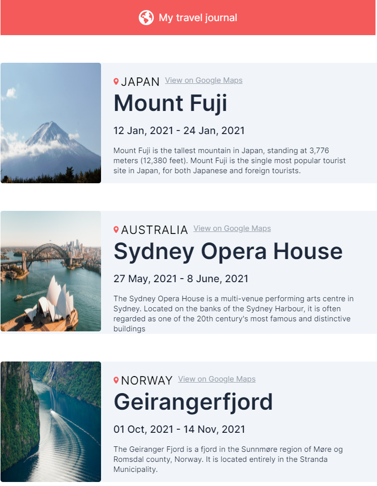

In this porject I have used props for passing onthe dynamic data using the .map() in javascript.

I have used Tailwind for styling, major parts of it is used creatina layout is flexbox. 
The data is craeted locally. In future the data will be renderred using the APIs

Figma link:-    https://www.figma.com/file/QG4cOExkdbIbhSfWJhs2gs/Travel-Journal?node-id=0%3A1&mode=dev

Project front end:- 

