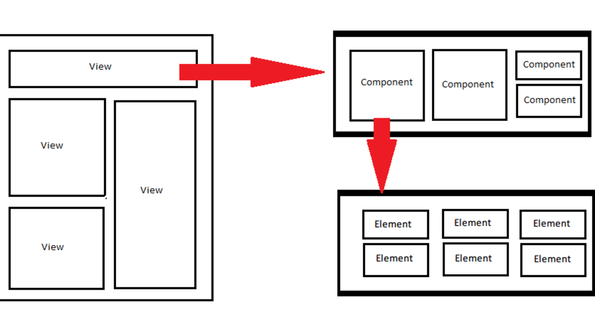
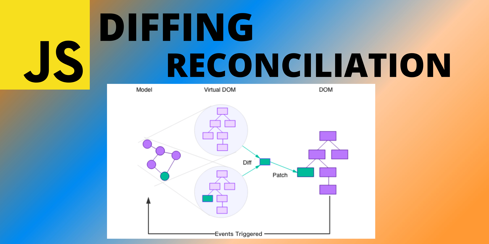
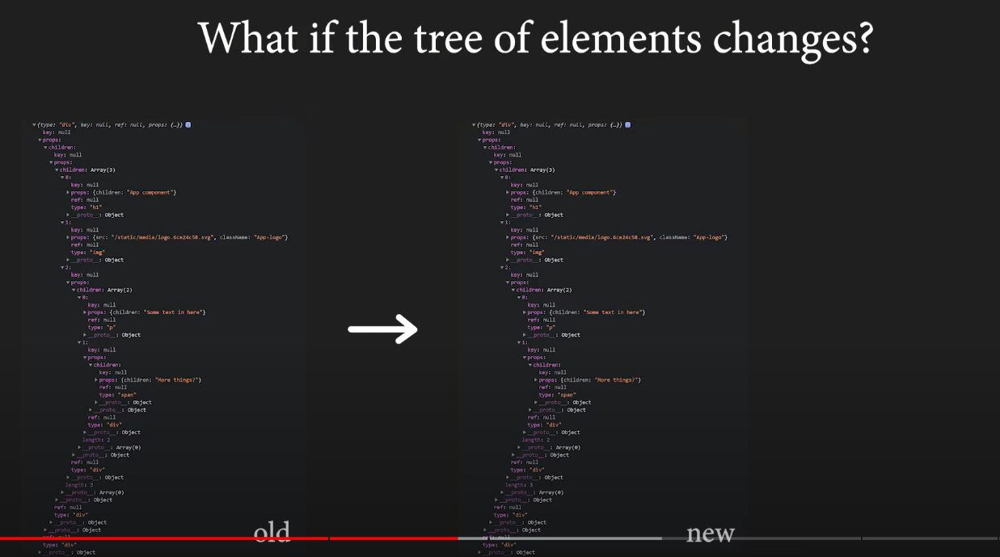

Q-What is React Component?

-A react component is a function that returns a react elements JSX thats looks like a html but it is JSX which is a specua syntax of a react which is eventually returning the JS object which is then turned into real DOM elements that people can see on the UI.

The dark and the light mode are added but for the main functioanlity check not for the over all project. It would take time to adjust the colors so, I haven't implemented it. 

The design link is:- https://www.figma.com/file/xA1rJVQOorqMW6xjGdBLcI/ReactFacts?type=design&node-id=0-1&mode=design&t=IRdBnPPr3ioRNv4s-0 

**React Lifecycle**:-

There are 3 Phases 
 1. Mount= The mounting happens when the state mounts on the page not renders. The mounting doesnot happens on renders rather than on the states changes. 
 2. Updating= When the states is changed the screeen re-renders. The updating in states is the phase 2, where the states get updated which causes the re-render. The state is updated on the DOM means on the UI.
 3. Unmount= In React, the concept of "unmounting" refers to the state of a component when it is removed from the DOM. In other words, unmounting occurs when a component is taken out of the UI and is no longer rendered on the screen.

**How react works under the hood**:-

 To understand how react works under the hood we need to understand
 1. React element:- when we create a functional component and consoel.log the function it displays the objects representing the DOM. It doesnot directly converts the code into the DOM but it converts into the plain JS object representing how DOM should look like. 
 2. React component:-they are the functions block that returns the react element.

 

 Before Jumping more deep into React's working let learn the difference between virtual DOM and real DOM.
 1. Real DOM:- The real DOM is the elements that we see on the page UI. It displays the html content in a Tree like structure. Wheere all the Html elements are being structed in a tree data structured manner. This is what we see on the UI 
 2. Virtual DOM:- The Virtual DOM is a concept introduced by React to optimize the updating process of the Real DOM. Keep it mind thta when react component state or props changes the React creates a Virtual DOM for the representation of UI. It looks like a Real DOM but it is not attacked in a tree of Real DOM.

Now, when the page renders at the very first time, the Virtual DOM elements are created and a Real DOM is also created for the display. When the state or props of the component changes, the changes does not effects the Real DOM. Because if the changes in the virtual DOM will be reflected to the real DOM directly. The real DOM will have a tree like struture which will cause a inefficient amount of deep tree structure. Instead the Virtual DOM is compared to the previous Virtual DOM react elements. The takes out the changes happened in Current Virtual DOM and then the changes are reflected into the Real DOM tree. This is also known as **Reconsiliation Algorithm**. This comparing algorithm makes the reat much faster. 
The reconsiliation is not the only step that standalone to compare and display the Actual changed content. Within a Reconsiliation process a algorithm called **diffing** comes in. The diffing algorithm checks the changed node within the tree and decides which changed props, states have to be adjusted in the real DOM. This algorithm is responsible for finding doing the smallest number of opreations to transform a tree. The algorithm image looks something like this.

As you may see a key property in the React element tree. This **key** plays the major part in optimization of the react's tree nodes trasversing during diffing. lets take an example.

Before explaining the key importance just keep it in mind that every time the current Virtual DOM is generated and compared with the old one the react assumes that the new DOM is totally different compared to the old one. Isn't it self-explainatory? Right? Lets see.

In the above image the elements of the components changes on re-render. Under the hood the diffing algorithm is deciding the newly updated changes to put into the Real DOM tree. During the reconciliation the previous Virtual DOM is compared with the current Virtual DOM as seen in the image above. It compares the the elements and find out the first 2 are the same but the third one is newly added. So, it keeps the changes of the 1st two elements and adds the third element in the Real DOM. But, what if the 1st two elements are same but there sequence is not the same, like the image below:- 

So, now react assumes that the new virtual DOM is totally a new one. Besides the sequence is just changed not the values. But React will add all of those 3 elements in the Real DOM tree making it inefficient. SO, here the **key** property comes in. The diffing algorithm compares the keys of the elements instead elements. So, the only newly created keys can be added into the Real DOM tree. Just like the image below

Hello

