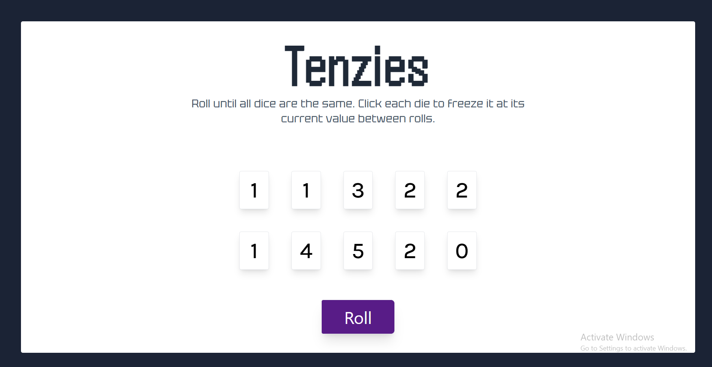

In This project I have used scss for styling and positions instead of playing with the flex positions.

I have used props in order to get the data dynamically instead of hard coded. The props I pass into the custom components to get the compornents each one differ. Props are objects.

I have used conditional props for more usage of the code.

Figma Link:- https://www.figma.com/file/4YjrygFEXOcDp9AAnVFv7o/Airbnb-Experiences?node-id=35%3A6&mode=dev

Project Image:- 

